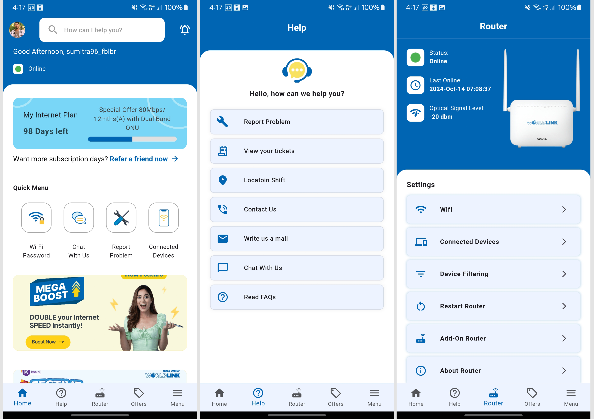
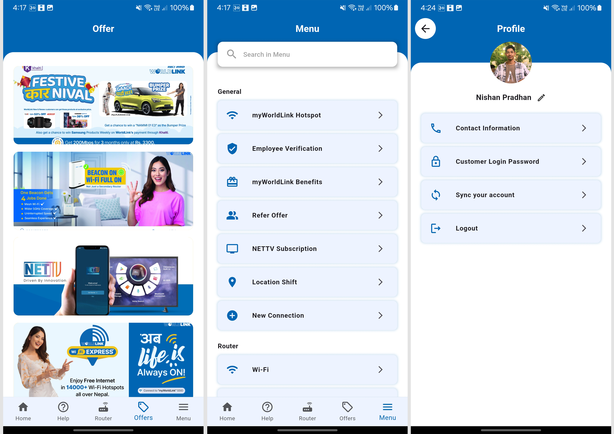

# Worldlink App UI Clone

This project is a Flutter application that clones the UI design of the Worldlink app. The aim is to create a responsive and aesthetically pleasing interface that mimics the original app's design.

## Features

- User-friendly navigation using a Bottom Navigation Bar
- Custom app bar with a search functionality
- Multiple screens including Home, Help, Router, Offers, and Menu
- Responsive design

## Screenshots




## Technologies Used

- Flutter
- Dart
- Material Design

## Setup Instructions

Follow the steps below to set up the project on your PC:

1. **Clone the repository:**
   ```bash
   git clone https://github.com/Nishan-Pradhan06/worldLink_app_ui_clone
   ```
